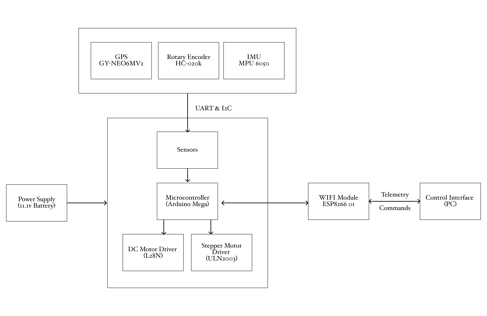
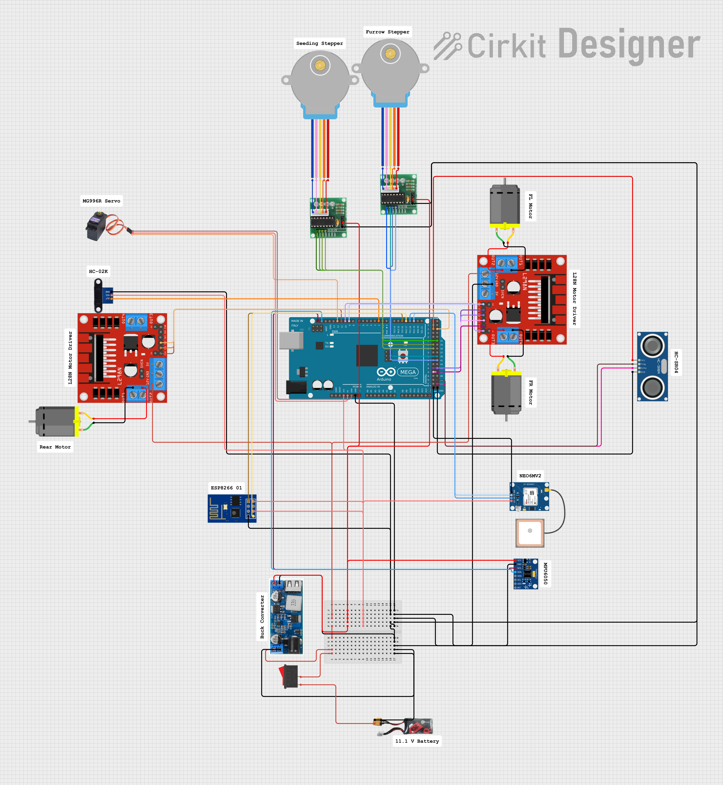

# System Architecture – Seeding Robot

## 1. Introduction
The seeding robot is designed to automate the process of planting seeds with consistent spacing and depth.  
This document explains the overall architecture, including the **mechanical design, electronics, software control**, and how these components interact.

---

## 2. System Overview


The robot is divided into three main subsystems:
- **Mechanical** – chassis, wheel system, seed dispensing and furrow opening.
- **Electronics** – microcontroller, motor drivers, sensors, power supply, motors.
- **Software** – navigation and seed placement logic.

---

## 3. Mechanical Design
- **Chassis:** 
    - Dimensions: 632.74 x 278.00 × 390.47 mm (L × W × H).
    - Materials: Fabricated primarily from PLA (3D-printed components) and laser-cut acrylic sheets in 3 mm and 6 mm thicknesses, complemented by steel fasteners (M3, M4, M5 nuts, bolts, and washers) for structural integrity.
    - Wheels: The wheel assembly repurposes 198 mm-diameter recycled filament spools as the primary frame. Custom-designed PLA treads interlock with the spools and are mechanically fastened via screws to provide traction and durability.

- **Seeding Mechanism:**
    - **Seed Hopper & Feeding:** The hopper is designed with an angled base to direct seeds under gravity toward the dispensing mechanism. A 3D-printed converging funnel is installed at the outlet to constrain seed flow and minimize double-feeding. The geometry of the funnel is optimized to maintain a single-file feed, reducing seed bridging and clogging.

    - **Dispensing Mechanism:** At the base of the hopper, the dispensing unit is driven by a 28BYJ-48 Stepper Motor (precise 1.8° step angle). The motor is coupled to a laser-cut acrylic seed plate (interchangeable disc) with customizable pocket dimensions. Each pocket is sized according to seed diameter (e.g., 3–6 mm) and angular spacing, allowing adjustable seed drop frequency and spacing along the row. During rotation, each pocket aligns with an aperture slot at the bottom of the hopper, releasing a single seed through gravity drop.

    - **Furrow Opening & Closing:** The furrower is actuated via a rack-and-pinion mechanism coupled to a worm-and-spur gear train. A secondary stepper motor drives the worm, which in turn rotates the spur gear to raise or lower the rack. This motion adjusts the penetration depth of the furrow opener. The furrow opener itself consists of two 3 mm acrylic blades mounted on a pivot shaft with miniature ball bearings, allowing smooth rotation and reduced wear. The angled blades form a V-shaped cut, guiding soil outward to create a uniform seed trench.

- **Design considerations:**
    - **Soil resistance**: To overcome soil resistance during furrow actuation, a **worm gear** was selected to couple the stepper motor to the furrow mechanism due to its **non-backdrivability** and inherent torque multiplication. The chosen **28BYJ-48 stepper motors**, while offering low nominal torque, were favored for their **low power consumption** and compact form factor. To compensate for the torque limitations, a **1:60 gear reduction** was implemented between the worm gear and spur gear. This configuration substantially increased output torque, albeit at the expense of actuation speed. The reduced speed of raising and lowering the furrow was deemed acceptable given the critical requirement of ensuring sufficient penetration force in soil.

    - **Speed Spacing:** Seed spacing is governed by **wheel odometry**, derived from encoder counts at the rear wheel. For cost-efficiency, the system employs a **single rear-wheel encoder** rather than encoders on all wheels. With appropriate assumptions, this still yields an accurate estimate of distance traveled and thus seed placement intervals. Furthermore, the **planting interval is parameterizable via the web interface**, enabling calibration for different crop types and row spacing requirements.

    - **Wheel Configuration:** The robot employs a **tricycle-style wheel layout**, with a single drive wheel at the rear and two supporting wheels at the front. While unconventional, this arrangement was inspired by the **Fendt Xaver robot** design. A wider front wheelbase was chosen to enhance **lateral stability**, particularly in **tilled or soft soil conditions**, where narrower configurations risk instability or sinking.

    - **Electronics Housing:** 
        The electronics housing was designed to **integrate and protect** the power supply, microcontroller, and associated wiring within a single enclosure. This compartment is located at the **front of the robot**, serving a dual purpose:  
        1. **System Integration** – By consolidating the electronics into one housing, cable routing is minimized and maintenance is simplified, reducing potential points of failure in the field.  
        2. **Weight Distribution** – Positioning the housing at the front shifts the center of mass forward. When the seed hopper is fully loaded, this placement counterbalances the rear load and provides additional **downforce** on the furrow mechanism, improving soil penetration and stability during operation.

- CAD files are located in: [`/hardware/cad/`](../hardware/cad/).

---

## 4. Electronics
- **Microcontroller:** Arduino Mega
- **WIFI Module:** ESP8266 01
- **Motor Drivers:** 
    1. L28N Dual H-Bridge
    2. ULN2003 
- **Motors:**
    1. DC Motor with Gearhead 12VDC 74mA 1120 RPM ~ 1100 g-cm
    2. 28BYJ-48 stepper motors ~ 300g-cm
- **Sensors:** (GPS, IMU, encoders, soil sensors if any).  
    1. NEO6M-V2 GPS Module
    2. MPU6050 6DOF IMU
    3. HC-020K Rotary Encoder
    4. HC-SR04 Ultrasonic Sensor
- **Power Supply:** 11.1 Volt 3S Battery with 1200mAh


Link: https://app.cirkitdesigner.com/project/0053ac62-e5af-4ed4-ab69-d646999af55c

---

## 5. Software Architecture
### 5.1 Control Layers
- **Low-Level (Firmware):** The low-level control is implemented on the Arduino Mega and is responsible for direct hardware interfacing and real-time task execution. This layer manages:
    - **Motor Control:**  
        - Implements PWM-based speed regulation for the DC drive motor via the L298N H-Bridge, supporting both forward and reverse motion.
        - Executes stepper motor sequencing for the 28BYJ-48 motors using the ULN2003 driver, enabling precise actuation of the seed dispensing plate and furrow depth mechanism.
        - Calculates differential wheel speeds based on Ackermann steering geometry, dynamically adjusting motor outputs for accurate path following.
    - **Sensor Polling & Data Acquisition:**  
        - Periodically reads encoder pulses from the HC-020K rotary encoder to compute wheel odometry and estimate linear displacement.
        - Polls the NEO6M-V2 GPS module and MPU6050 IMU over serial/I2C, parsing raw data for position and orientation updates.
        - Monitors the HC-SR04 ultrasonic sensor for obstacle detection, triggering avoidance routines if necessary.
    - **Seed Dispensing Logic:**  
        - Synchronizes seed drop timing with wheel odometry, activating the stepper-driven seed plate when the robot traverses the programmed interval distance.
        - Supports configurable seed spacing and drop frequency via parameters received from the web interface.
    - **Furrow Depth Actuation:**  
        - Controls the rack-and-pinion mechanism by driving the secondary stepper motor, adjusting furrow opener depth in response to user input or pre-set planting profiles.
    - **Communication:**  
        - Handles serial communication with the ESP8266 WiFi module, parsing incoming HTTP requests for control commands and transmitting sensor data to the web interface.
        - Implements a non-blocking main loop using timer interrupts and state machines to ensure responsive multitasking and minimize latency in sensor feedback and actuator control.
            - **Command Format:** HTTP GET requests to `http://<robot_ip>/<command>?speed=<val>&radius=<val>&depth=<val>`
            - **Supported Commands:** `forward`, `backward`, `left`, `right`, `stop`, `plant`, `pause_plant`, `furrow_up`, `furrow_down`
            - **Response Format:** JSON, e.g. `{"status":"OK"}`

- **High-Level:** navigation logic, sensor fusion (GPS + IMU + encoder).
    - **Navigation:**
        - In the current implementation, navigation and task execution are user-driven via the web-based control hub. The user interface allows manual specification of commands such as moving forward at a defined speed, planting seeds at a set depth, and executing turns with a configurable turning radius. These commands are transmitted to the robot as HTTP requests, which are parsed by the onboard ESP8266 module and relayed to the Arduino firmware for execution.
        - Each navigation command is mapped to low-level motor and actuator control routines, with parameters (speed, radius, depth) dynamically applied to the corresponding hardware interfaces. The robot does not autonomously plan its trajectory; instead, it responds to discrete user inputs in real time.
        - Future versions will incorporate autonomous navigation using path planning algorithms (e.g., A*, Dijkstra, or coverage planning) to optimise planting efficiency within a user-defined GPS boundary. The robot will continuously localize itself using fused GPS, IMU, and encoder data, and follow computed paths while automatically toggling planting actions based on its position and task schedule. This will enable fully autonomous operation, minimizing user intervention and maximizing throughput.
    - **Sensor Fusion:**  
        - Real-time localization of the robot is achieved through multi-sensor fusion using an extended Kalman filter (EKF), implemented off-board on the PC for computational efficiency and scalability. The decision to run the filter externally is driven by the high computational load and increased state dimensionality required for accurate pose estimation, which exceeds the capabilities of the onboard microcontroller.
        - The EKF prediction step integrates wheel odometry from the HC-020K rotary encoder and inertial measurements from the MPU6050 IMU (accelerometer and gyroscope). Since the IMU is limited to 6 degrees of freedom and lacks a magnetometer, absolute heading cannot be directly measured; instead, orientation is inferred by combining the servo steering angle and gyroscopic yaw rate, subject to kinematic constraints of the robot.
        - The correction step utilizes GPS position data from the NEO6M-V2 module, providing global 2D coordinates to correct drift in the predicted state. The filter fuses these asynchronous sensor streams, compensating for noise and bias, to output a continuous estimate of the robot’s position and orientation. This fused state is used for navigation, control, and logging, and can be extended to incorporate additional sensors or higher-order motion models as needed.

### 5.2 Autonomous Loop
```text
Start → Init (Read Sensors & Establish WiFi connection) → Get User Input → Start Operation 
→ [ Drive Forward → Lower Furrow → Plant Seeds → If Bounds < 2m → Pause Planting → Turn → Path Complete? ] 
→ If No → Repeat Loop 
→ If Yes → Stop